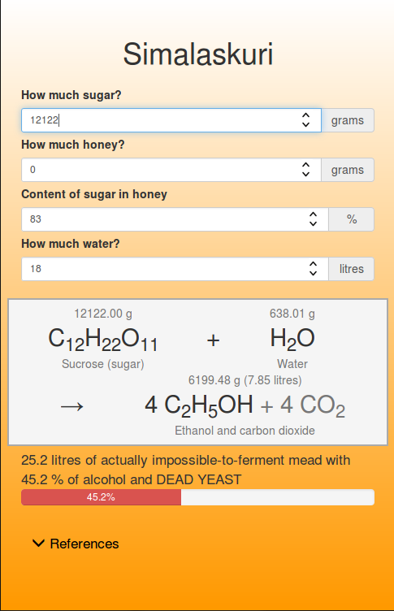
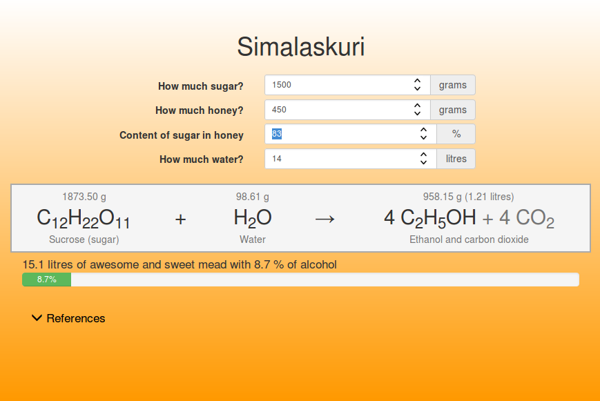
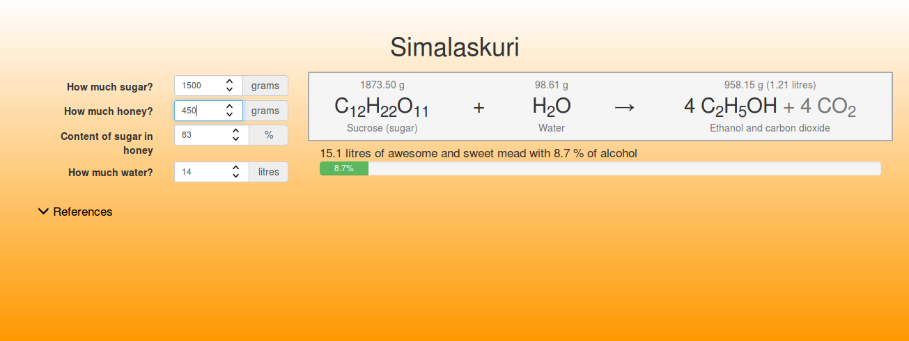

# MeadMate

MeadMate (a.k.a. "Simalaskuri" in finnish) is a small web page for calculating appropriate amount of sugar, water and honey for fermenting mead.  
The motivation for creating this was partly to get to know the chemical reactions, partly to get a proper calculator for my own needs and partly to learn how to write web applications.  

**2020 Update**  
MeadMate was rewritten in February 2020 and now uses ReactJS as the JavaScript framework and Bootstrap 4 for styling.  
Therefore, it can now also be run independently with NodeJS.  

# Deploying
## Docker
A `Dockerfile` and an example file for `docker-compose`.
TODO

## Manually
TODO

## Screenshots
TODO

Older screenshots:

